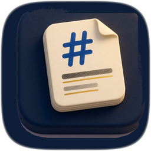

<p align="center">
  
</p>

<h1 align="center">TenLing</h1>

<p align="center">
  <strong>Markdown, quietly.</strong><br>
  A calm desktop app for writing, reading, and presenting Markdown.<br>
  Your files stay plain <code>.md</code> — open them anywhere.
</p>

<p align="center">
  <a href="https://github.com/SihanTeng/tenling/releases/latest"></a>
  <a href="https://github.com/SihanTeng/tenling/releases/latest"></a>
  <a href="CODE_OF_CONDUCT.md"></a>
  <a href="https://github.com/SihanTeng/tenling/releases/latest"></a>
</p>

<p align="center">
  <a href="#install">Install</a>
  ·
  <a href="#features">Features</a>
  ·
  <a href="#screenshots">Screenshots</a>
  ·
  <a href="#keyboard-shortcuts">Shortcuts</a>
  ·
  <a href="#contributing">Contributing</a>
</p>

<br>

<p align="center">
  
</p>

## Why TenLing?

Most Markdown tools force a choice: a heavy knowledge base, a split source/preview pane, or a paid single-purpose editor.

**TenLing** is for people who just want to open a file and write.

- **What you see is what you write** — format headings, lists, tasks, and tables without staring at syntax
- **One file, two jobs** — the same document becomes slides when you present
- **Your files, your folder** — portable `.md` files on disk, no vault lock-in
- **Light on your machine** — uses the system web view instead of shipping a whole browser

## Features

| | |
| --- | --- |
| **Visual editing** | Bold, italic, headings, lists, tasks, quotes, code, tables, images, and links from the toolbar or shortcuts |
| **LaTeX math** | `$inline$` and `$$display$$` formulas typeset with KaTeX as you write |
| **Slash commands** | Type `/` for a Notion-style menu of blocks — headings, lists, tables, and more |
| **Presentation mode** | Turn H1 and H2 headings into slides — no separate deck to maintain |
| **Outline & files** | Jump sections from the outline; open a folder and browse Markdown nearby |
| **Find & replace** | Search the open document quickly (`⌘F` / `Ctrl+F`) |
| **Export** | Save as HTML or PDF; copy as HTML when you need it elsewhere |
| **Light & dark** | Follow the system appearance, or pick light or dark yourself |
| **Auto-updates** | Get new versions signed from GitHub Releases (see [Updating](#updating)) |

## Screenshots

<p align="center">
  
  &nbsp;
  
</p>

<p align="center">
  <sub>Light and dark themes</sub>
</p>

<br>

<p align="center">
  
</p>

<p align="center">
  <sub>Present mode — slides generated from your headings</sub>
</p>

<br>

<p align="center">
  
</p>

<p align="center">
  <sub>Start fresh, open a file, or open a folder</sub>
</p>

## Install

### One-liner

**macOS / Linux:**

```bash
curl -fsSL https://raw.githubusercontent.com/SihanTeng/tenling/main/install.sh | bash
```

**Windows** (PowerShell):

```powershell
irm https://raw.githubusercontent.com/SihanTeng/tenling/main/install.ps1 | iex
```

The scripts download the latest [GitHub Release](https://github.com/SihanTeng/tenling/releases/latest) for your platform (DMG → Applications, AppImage → `~/.local/bin/tenling`, MSI → Windows Installer). Pin a version with `TENLING_VERSION=v0.3.0`.

### Manual download

Download a package from the
[**Releases**](https://github.com/SihanTeng/tenling/releases/latest) page.

Installer files use a single naming scheme:

```text
tenling-{version}-{os}-{arch}.{ext}
```

| File | Platform |
| --- | --- |
| `tenling-*-macos-universal.dmg` | macOS (Apple silicon + Intel) |
| `tenling-*-linux-x64.AppImage` | Linux (portable) |
| `tenling-*-linux-x64.deb` | Debian / Ubuntu |
| `tenling-*-linux-x64.rpm` | Fedora / RHEL |
| `tenling-*-windows-x64.msi` | Windows |

(Also on each release: tiny `.sig` files and `latest.json` for automatic updates — not installers.)

### macOS

**Homebrew** (recommended):

```bash
brew tap SihanTeng/tenling
brew install --cask tenling
```

**Or** download `tenling-*-macos-universal.dmg`, open it, and drag **TenLing** into
**Applications**. Works on Apple silicon and Intel Macs (macOS 10.15+).

The Apple release pipeline requires a Developer ID signature, Apple notarization,
and Gatekeeper acceptance before publishing a Mac installer. Homebrew verifies
the download's SHA-256 before installing it.

### iPhone, iPad, and Mac App Store

Free App Store listings are being prepared. They are not yet publicly available.
See [Apple distribution](docs/apple-release.md) for build instructions and the
remaining submission requirements.

### Linux

**Debian / Ubuntu (APT repo, no account):**

```bash
echo "deb [trusted=yes] https://sihanteng.github.io/tenling/apt ./" | sudo tee /etc/apt/sources.list.d/tenling.list
sudo apt update
sudo apt install tenling
```

**Fedora (COPR — after you enable the project):**

```bash
sudo dnf copr enable <your-fedora-user>/tenling
sudo dnf install tenling
```

**Fedora / RHEL (static DNF repo, no account):**

```bash
sudo tee /etc/yum.repos.d/tenling.repo <<'EOF'
[tenling]
name=TenLing
baseurl=https://sihanteng.github.io/tenling/rpm
enabled=1
gpgcheck=0
EOF
sudo dnf install tenling
```

**Arch (AUR):**

```bash
yay -S tenling-bin
```

**One-off packages** from [Releases](https://github.com/SihanTeng/tenling/releases/latest):

```bash
# Debian / Ubuntu
sudo apt install ./tenling-*-linux-x64.deb

# Fedora / RHEL
sudo dnf install ./tenling-*-linux-x64.rpm

# Portable AppImage
chmod +x tenling-*-linux-x64.AppImage && ./tenling-*-linux-x64.AppImage
```

### Windows

**Chocolatey:**

```powershell
choco install tenling
```

**Or** download `tenling-*-windows-x64.msi` and run it. If WebView2 is missing, the
installer can fetch it for you.

If SmartScreen warns about an unsigned build, choose **More info → Run anyway**
after you have verified the download came from this repository’s Releases page.

Package-manager coverage (Homebrew, APT, DNF/COPR, AUR, Chocolatey) is
documented in [docs/distribution.md](docs/distribution.md).

## Getting started

1. Open **TenLing**
2. Choose **New Document**, **Open File…**, or **Open Folder…**
3. Write with the toolbar, or use shortcuts below
4. Press **⌘⇧P** (Mac) or **Ctrl+Shift+P** (Windows/Linux) to present

Your document is a normal Markdown file. Save it anywhere; open it later in TenLing
or any other editor.

## Keyboard shortcuts

| Action | macOS | Windows / Linux |
| --- | --- | --- |
| New document | `⌘N` | `Ctrl+N` |
| Open | `⌘O` | `Ctrl+O` |
| Save | `⌘S` | `Ctrl+S` |
| Save as | `⌘⇧S` | `Ctrl+Shift+S` |
| Find | `⌘F` | `Ctrl+F` |
| Present | `⌘⇧P` | `Ctrl+Shift+P` |
| Exit present | `Esc` | `Esc` |
| Next / previous slide | `→` / `←` or `Space` | same |

Formatting shortcuts (bold, italic, and so on) follow the usual platform
conventions while the editor is focused.

## Updating

TenLing checks for updates when it launches. You can also use **File → Check for
Updates…**.

| Install method | How updates arrive |
| --- | --- |
| macOS (DMG or Homebrew), Windows (MSI / Chocolatey), Linux (AppImage) | In-app, signed download from GitHub Releases |
| Linux APT / static DNF / COPR | `apt` / `dnf upgrade tenling` |
| AUR (`tenling-bin`) | `yay -Syu` (rebuilds from new AppImage) |

## Contributing

Bug reports, ideas, and pull requests are welcome.

- Please read the [**Code of Conduct**](CODE_OF_CONDUCT.md) before participating
- Open an [issue](https://github.com/SihanTeng/tenling/issues) for bugs or feature ideas
- Prefer small, focused PRs with a short description of *why*

### Develop from source

Requirements: [Bun](https://bun.sh), [Rust](https://rustup.rs), and the
[Tauri prerequisites](https://v2.tauri.app/start/prerequisites/) for your OS.

```bash
bun install
bun run dev          # desktop app
# or
bun run dev:web      # UI only in the browser
```

Useful checks:

```bash
bun run test
bun run lint
bun run typecheck
```

### Maintainers

`bun run version` bumps the version, tags, and triggers the Release workflow
(installers, name normalize, OTA signatures, package managers).

**Secrets & variables (single registry):** [`.github/SECRETS.md`](.github/SECRETS.md)

Distribution how-tos: [`docs/distribution.md`](docs/distribution.md)

## Community standards

This project follows the [Contributor Covenant Code of Conduct](CODE_OF_CONDUCT.md).
By participating, you agree to uphold it.

## Acknowledgments

Built with [Tauri](https://tauri.app), [TipTap](https://tiptap.dev), React, and
[Remotion](https://www.remotion.dev) for presentation slides.

---

<p align="center">
  <sub>TenLing — made for people who write in Markdown and want a quieter desktop.</sub>
</p>
